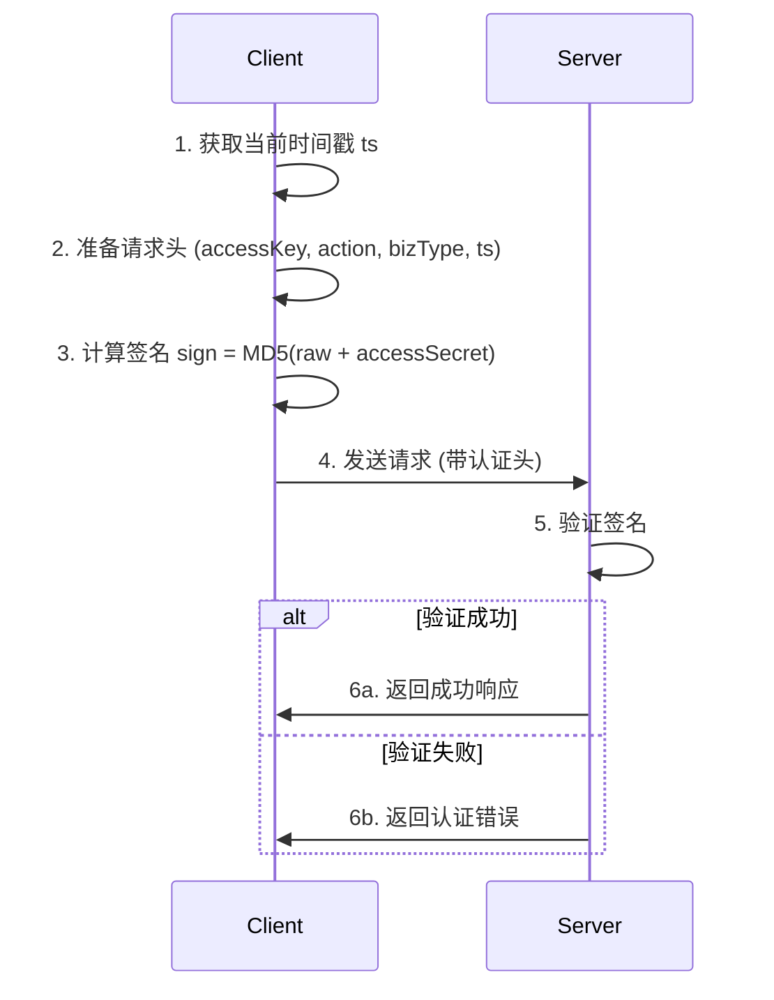

所有 API 请求都需要进行认证。认证是通过在 HTTP 请求头中添加以下参数实现的：

## 认证头参数

| 参数名 | 说明 | 示例 |
|-------|------|------|
| accessKey | 访问密钥 | nx-1255818653225010302-2682 |
| action | 操作类型 | nxai |
| bizType | 业务类型 | 1 |
| ts | 时间戳（毫秒） | 1693235584320 |
| sign | 签名值 | 计算生成，见下文 |

## 签名生成方法

签名使用 MD5 算法，按照以下步骤生成：

```javascript
function calcSign(headers, body, accessSecret) {
    let raw = `accessKey=${headers.accessKey}&action=${headers.action}&bizType=${headers.bizType}&ts=${headers.ts}`;
    if (body) {
        raw += `&body=${body}`;
    }
    raw += `&accessSecret=${accessSecret}`;

    const CryptoJS = require('crypto-js');
    const sign = CryptoJS.MD5(raw).toString();
    return sign;
}

// 示例使用
// 1. 获取当前时间戳
const ts = Date.now().toString();

// 2. 准备请求头信息
const headers = {
    "accessKey": "您的accessKey", // 例如: nx-1255818653225010302-2682
    "action": "nxai",
    "bizType": "1",
    "ts": ts
};

// 3. 请求体 (如果有)
const body = JSON.stringify(request.body); // 请求体JSON字符串

// 4. 您的访问密钥
const accessSecret = "您的accessSecret"; // 例如: 54f1014894b1480bb6c85e7ba11f257c

// 5. 计算签名
const sign = calcSign(headers, body, accessSecret);

// 6. 将计算出的sign和ts添加到请求头
headers.sign = sign;
```

## 认证示例 (Node.js)

下面是一个完整的 Node.js 请求示例，包含认证过程：

```javascript
const axios = require('axios');
const CryptoJS = require('crypto-js');

// 认证参数
const accessKey = "nx-1255818653225010302-2682"; // 替换为您的 accessKey
const accessSecret = "54f1014894b1480bb6c85e7ba11f257c"; // 替换为您的 accessSecret
const action = "nxai";
const bizType = "1";

// 计算签名的函数
function calcSign(headers, body, accessSecret) {
    let raw = `accessKey=${headers.accessKey}&action=${headers.action}&bizType=${headers.bizType}&ts=${headers.ts}`;
    if (body) {
        raw += `&body=${body}`;
    }
    raw += `&accessSecret=${accessSecret}`;
    
    return CryptoJS.MD5(raw).toString();
}

async function callAPI() {
    // 获取当前时间戳
    const ts = Date.now().toString();
    
    // 请求体
    const requestBody = {
        // 根据实际API要求填写请求参数
        "createStartTs": 1744041600,
        "createEndTs": 1746719999,
        "pageNumber": 1,
        "pageSize": 10
    };
    
    // 请求头
    const headers = {
        "accessKey": accessKey,
        "action": action,
        "bizType": bizType,
        "ts": ts
    };
    
    // 计算签名
    const bodyString = JSON.stringify(requestBody);
    const sign = calcSign(headers, bodyString, accessSecret);
    
    // 添加签名到请求头
    headers.sign = sign;
    
    try {
        // 发送请求
        const response = await axios({
            method: 'post',
            url: 'http://114.119.172.15:9080/openapi/aiagent/task/list',
            headers: headers,
            data: requestBody
        });
        
        console.log('API响应:', response.data);
        return response.data;
    } catch (error) {
        console.error('API调用失败:', error);
        throw error;
    }
}

// 调用API
callAPI();
```

## 请求序列图



## 常见问题

1. **签名验证失败**
   - 检查 accessKey 和 accessSecret 是否正确
   - 确认 ts 是否为当前时间戳（毫秒）
   - 检查请求体的序列化是否与签名计算时一致

2. **时间戳问题**
   - 服务器可能会验证时间戳是否在合理时间范围内
   - 确保您的系统时间是准确的

3. **参数顺序**
   - 生成签名时的参数顺序必须与示例中的一致 