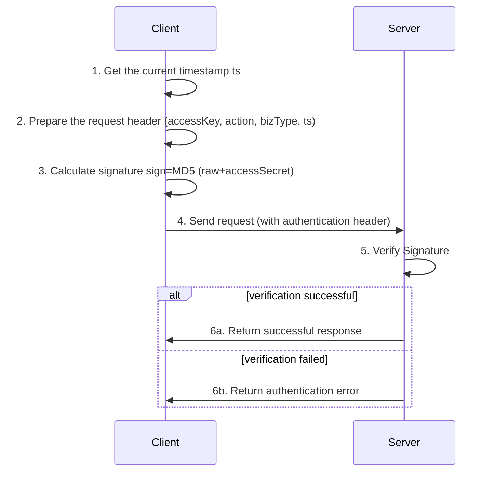

All API requests require authentication. Authentication is achieved by adding the following parameters to the HTTP request header:

## Authentication header parameters

|Parameter Name | Description | Example|
|-------|------|------|
|AccessKey | Access Key | nx-125581865325010302682|
|Action | operation type | nxai|
|BizType | Business Type | 1|
|TS | Timestamp (milliseconds) | 1693235584320|
|Sign | Signature Value | Calculation Generation, see below|

## Signature generation method

The signature is generated using the MD5 algorithm according to the following steps:

```javascript
function calcSign(headers, body, accessSecret) {
let raw = `accessKey=${headers.accessKey}&action=${headers.action}&bizType=${headers.bizType}&ts=${headers.ts}`;
if (body) {
raw += `&body=${body}`;
}
raw += `&accessSecret=${accessSecret}`;

const CryptoJS = require('crypto-js');
const sign = CryptoJS.MD5(raw).toString();
return sign;
}

//Example usage
// 1. Get the current timestamp
const ts = Date.now().toString();

// 2. Prepare request header information
const headers = {
'accessKey': 'Your accessKey',//Example: nx-125581865325010302682
"action": "nxai",
"bizType": "1",
"ts": ts
};

// 3. Request body (if any)
const body = JSON.stringify(request.body); //Request body JSON string

// 4. Your access key
Const accessSecret="Your accessSecret";//Example: 54f1014894b1480bb6c85e7Ba11f257c

// 5. Calculate Signature
const sign = calcSign(headers, body, accessSecret);

// 6. Add the calculated sign and ts to the request header
headers.sign = sign;
```

## Authentication Example (Node.js)

Here is a complete example of a Node.js request, including the authentication process:

```javascript
const axios = require('axios');
const CryptoJS = require('crypto-js');

//Authentication parameters
const accessKey = "nx-1255818653225010302-2682"; //Replace with your access key
const accessSecret = "54f1014894b1480bb6c85e7ba11f257c"; //Replace with your accessSecret
const action = "nxai";
const bizType = "1";

//Function for calculating signatures
function calcSign(headers, body, accessSecret) {
let raw = `accessKey=${headers.accessKey}&action=${headers.action}&bizType=${headers.bizType}&ts=${headers.ts}`;
if (body) {
raw += `&body=${body}`;
}
raw += `&accessSecret=${accessSecret}`;
    
return CryptoJS.MD5(raw).toString();
}

async function callAPI() {
//Get the current timestamp
const ts = Date.now().toString();
    
//Request Body
const requestBody = {
//Fill in the request parameters according to the actual API requirements
"createStartTs": 1744041600,
"createEndTs": 1746719999,
"pageNumber": 1,
"pageSize": 10
};
    
//Request header
const headers = {
"accessKey": accessKey,
"action": action,
"bizType": bizType,
"ts": ts
};
    
//Calculate Signature
const bodyString = JSON.stringify(requestBody);
const sign = calcSign(headers, bodyString, accessSecret);
    
//Add signature to request header
headers.sign = sign;
    
try {
//Send request
const response = await axios({
method: 'post',
url: ' http://114.119.172.15:9080/openapi/aiagent/task/list ',
headers: headers,
data: requestBody
});
        
Console.log ('API response: ', response. data);
return response.data;
} catch (error) {
Console. error ('API call failed: ', error);
throw error;
}
}

//Call API
callAPI();
```

## Request sequence diagram



## Frequently Asked Questions

1. * * Signature verification failed**
-Check if the access key and access secret are correct
-Confirm if ts is the current timestamp (in milliseconds)
-Check if the serialization of the request body is consistent with the signature calculation

2. * * Timestamp issue**
-The server may verify whether the timestamp is within a reasonable time range
-Ensure that your system time is accurate

3. * * Parameter order**
-The order of parameters when generating signatures must be consistent with the example